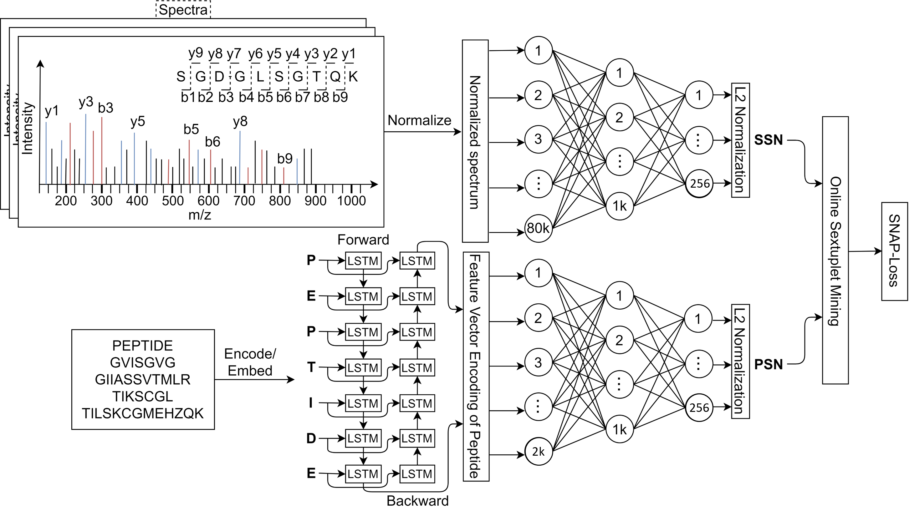
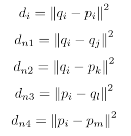
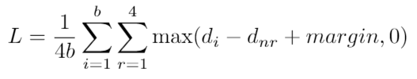

## Welcome to the Official Site of SpeCollate

SpeCollate is the first Deep Learning-based peptide-spectrum similarity network. It allows searching a peptide database by generating embeddings for both mass spectra and database peptides. K-nearest neighbor search is performed on a GPU in the embedding space to find the k (usually k=5) nearest peptide for each spectrum.

### Network Architecture

SpeCollate network consists of two branch, i.e., Spectrum Sub-Network (SSN) and Peptide Sub-Network (PSN). SSN processes spectra and generates spectral embeddings while PSN processes peptide sequences and generates peptides embeddings. Both types of embeddings are generated in real space of dimension 256. The network architecture is shown in Fig 1 below.

    
*Fig 2: SpeCollate network architecture. Spectra are encodded in dense arrays of length 80,000 each where each index represents a m/z bin width of 0.1 Da. Hence, spectra with maximum m/z of 8,000 can be encoded using this technique. Encoded spectra are passed through SSN which consists of two fully connected layers of dimessions 80,000 x 1,024 and 1,024 x 256. Output from the second layer is normalized to have unit length. Similarly, peptides sequences are integer encoded where each amino acid and modification character is assigned a unique integer value. These encoded peptide vectors are passed through the embedding layer which learns 256 dimension embedding for each amino acid. The output from the embedding layer is then passed throug PSN which consists of two BiLSTMs and two fully connected layers of length 2,048 x 1,024 and 1,024 x 256. Output from the last layer is normalzied to unit length.*

### SNAP-Loss Function

To train SpeCollate, we design a custom loss function called SNAP-Loss which is inspired from Triplet Loss function. In SNAP-Loss, loss is calcualted over sextuplets of datapoints where each sextuplet consists of an anchor spectrum, a positive peptide, two negative spectra and two negative peptides.

We design SNAP-loss which extends Triplet-Loss to multi-modal data, in our case numerical spectra and sequence peptides. For this purpose, we consider all possible negatives (*qj, pk, ql, pm*) for a given positive pair (*qi, pi*) and average the total loss. The four possible negatives are explained below:
- *qj*: The negative spectrum for *qi*.
- *pk*: The negative peptide for *qi*.
- *ql*: The negative spectrum for *pi*.
- *pm*: The negative peptide for *pi*.

To calculate the loss value, we first define a few variables that are precomputed in distances matrices above as follows:

Then the SNAP-loss is calculated for a batch of size $b$ as follows:

