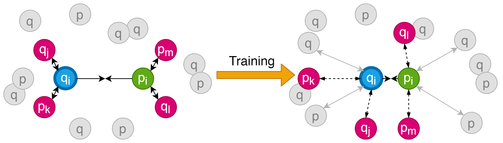

## Training SpeCollate

SpeCollate is trained using the [SNAP-Loss](index.md) function where the loss value is calculated from sextuplets of datapoints. Here we will describe the training process and how users can retrain the model using the standalone executable and [preprocessed data](https://drive.google.com/uc?export=download&id=10bZbMdc2eN_l4ToJd6ruzNX7t6wIUfHw) provided.

SpeCollate consists of two branches SSN and PSN. Spectra are first encoded into dense vectors of length 80,000k each with m/z binning of 0.1 Da. Peptides sequences are encoded by assigning unique integer value to each amino acid and the modifications. Batches of spectra and peptides of size 1024 each are constructed where spectra and their positive peptides lie on the same index within their corresponding batches. Both spectra and peptides are forward passed through the network and 256 dimension embedding is generated for each spectrum and peptide in the batch. See [SpeCollate](index.md) for more details on the architecture and how the embeddings are generated.

After the forward pass, sextuplets are generated using Online Hardest Sextuplet Mining where closest negative peptides and spectra to the anchor spectrum and positive peptide are chosen as the negative examples.

The training process is visualized in the figure below:

Once, the sextuplets are genrated, the loss is calculated using the SNAP-Loss function and the network paramenters are updated by back propagation.

Tuned hyperparameters are given in table 1 below and the ranges for which their value was tuned for:

| Hyperparameter | Value  | Values Tested                                        |
| -------------- | ------ | ---------------------------------------------------- |
| Learning Rate  | 0.0001 | 0.00001, 0.00005, 0.0001, 0.0005, 0.001, 0.005, 0.01 |
| Weight Decay   | 0.0001 | 1xe^-6, 1xe^-5, 1xe^-4, 1xe^-3                       |
| Margin         | 0.2    | 0.1, 0.2, 0.3, 0.4                                   |
| Embedding Dim  | 256    | 32, 64, 128, 256, 512, 1028, 2048                    |
| FC Layers      | 2      | 1, 2, 3                                              |
| BiLSTM Layers  | 2      | 1, 2, 3, 4                                           |

SpeCollate is available as a standalone executable that can be downloaded and run on a Linux server with a Cuda-enabled GPU.

Two different executables are included in the downloadable specollate.tar.gz file; 1) specollate_train for retraining a model and 2) specollate_search for performing database search using a trained model. A pre-trained model is provided within the download file.

The below sections explain the setup for retraining the model.

### Prerequisites

- A Computer with Ubuntu 16.04 (or later) or CentOS 8.1 (or later).
- At least 120GBs of system memory and 10 CPU cores.
- Cuda enabled GPU with at least 12 GBs of memory. Cuda Toolkit 10.0 (or later).
- OpenMS tool for creating custom peptide database. (Optional)
- Crux for FDR analysis using its percolator option.

### Retrain the Model

1. Download the [specollate.tar.gz](https://drive.google.com/uc?export=download&id=1iAR4a6qQQyS2pDFMRqCd7Jaofsmxwdsp) file and extract the contents using the following command:  
`tar -xzf specollate.tar.gz`  
The extracted directory contains multiple files, including:
    - `specollate-train`: This is the executable for training SpeCollate.
    - `specollate-search`: This is the executable for database search.
    - `config.ini`: Parameter file for training and searching.
    - `models (dir)`: Contains the pre-trained model. New models will also be stored here.
    - `percolator (dir)`: Percolator input (.pin) files be placed here after the search is complete.

2. Download the preprocessed data for training ([here](https://drive.google.com/uc?export=download&id=10bZbMdc2eN_l4ToJd6ruzNX7t6wIUfHw)) and extract the contents using:  
`tar -xzf specollate-training-data.tar.gz`

3. Open the config.ini file from step 1 in your favorite text editor and set the following parameters:
    - `in_tensor_dir` in [preprocess] section: Absolute path of the decompressed file from step 2.
    - `model_name` in [ml] section: The name by which to wish to save the trained model file.
    - other parameters in the [ml] section: You can adjust different hyperparameters in the [ml] section, e.g., learning_rate, dropout, etc.

4. Execute the specollate_train file.  
`./specollate_train`
