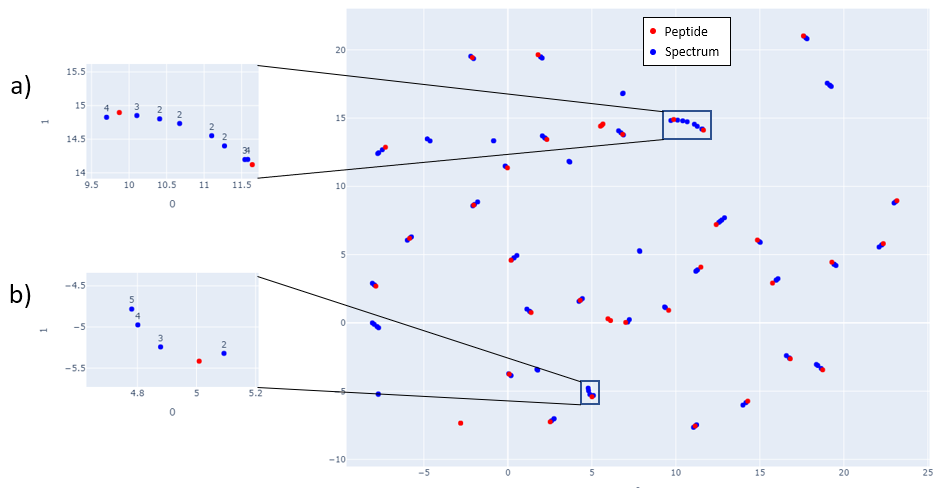
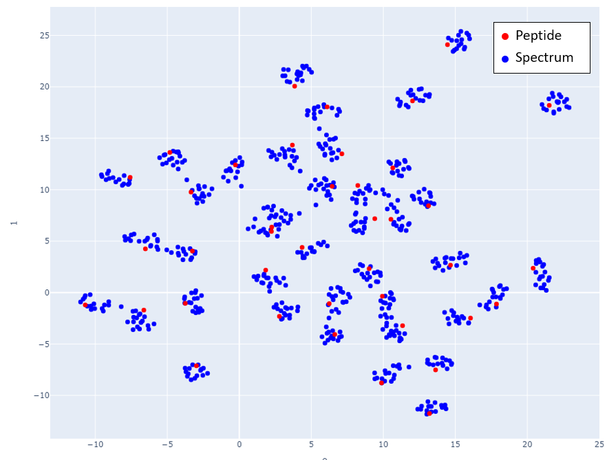

## Training SpeCollate

SpeCollate is trained on tuples of six datapoints, i.e., the anchor spectrum, the positive peptide, two negative peptides, and two negative spectra. The objective function is designed to project the positive pair closer to each other than the remaining negative peptides and spectra. To avoid overfitting, the negative examples are chosen dynamically after each positive pass through the network such that they are closest to the positive pair. Details of the training process can be found in the training section of the paper.

Here we will show the UMAP projections of the embedded spectra and peptides generated by the trained network.

In Fig 1, mappings of spectra and peptide embeddings from NIST Library Human-HCD-Phospho are shown at mass 2000 Da. Peptides are shown in red points, and the clustering of the blue points around the peptide (red point) represents the spectra belonging to that peptide. 

  
*Fig 1: Spectra and Peptide projections of the embedded spectra and peptides. Embeddings are generated from 40 peptides and their corresponding spectra selected in increasing precursor mass value starting at 2000 Da. Adjacent mass values are chosen to show that the network is able to distinguish peptides and spectra that are close in mass. Subfigures a) and b) show how spectra with different charges map close to the peptides. Although different charge spectra are mapped close to the peptide, they still tend to be relatively farther from other charges. In subfigure a) spectra with charge 4 are closest to the peptide while in subfigure b) spectra with lower charge are closest to the peptide.*

Figs 2-6 show the mappings for Proteome Tools library data. Peptides with more than 15 corresponding spectra of different precursor charge are selected.

    
*Fig 2: Proteome Tools spectra and peptides selected at 1500 Da.*

<figure><figcaption>image caption</figcaption></figure>
  
  
  
*Fig 3: Zoom in of Fig 2.*
  
  
  
  
*Fig 4: Proteome Tools spectra and peptides selected at 1700 Da.*
  
  
  
  
*Fig 5: Proteome Tools spectra and peptides selected at 2300 Da.*
  
  
  
  
*Fig 6: Proteome Tools spectra and peptides selected at 2500 Da.*
